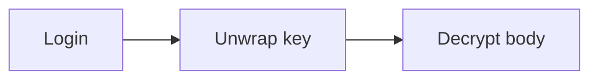

## What this document verifies \{#what}

This whole body is encrypted at build time. This sentence (SECRET-BODY-EN) must
not exist as plaintext in the deployed HTML.

The [[diffusion]] wikilink and the [[comfyui]] tool link are only visible after
decryption.

## Diagram \{#diagram}



## Code \{#code}

```bash
echo "copy button should mount after decryption"
```
