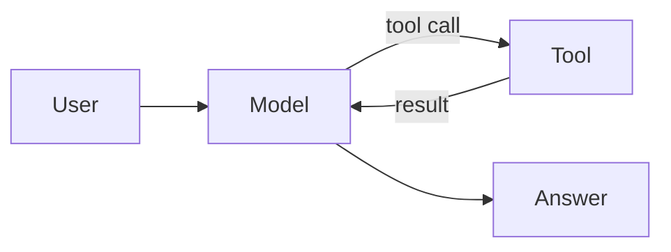

import Lead from 'stack-site-builder/components/Lead.astro';
import Bookmark from 'stack-site-builder/components/Bookmark.astro';
import Embed from 'stack-site-builder/components/Embed.astro';

<Lead>An agent is a loop: the model decides, a tool runs, the result feeds back. This course builds that loop from scratch.</Lead>

## What you'll build \{#what-youll-build}

A single-file agent that can search and summarize, with a budget guardrail.

## Prerequisites \{#prerequisites}

Basic Python and an API key. The reference below covers the mental model:

<Bookmark
  url="https://www.anthropic.com/engineering/building-effective-agents"
  title="Building effective agents"
  description="Patterns for agentic systems — workflows vs agents, and when to use which."
/>

## Try it \{#try-it}

<Embed src="https://example.invalid/demo/agent-loop/" title="Agent loop demo" ratio="4:3" />
