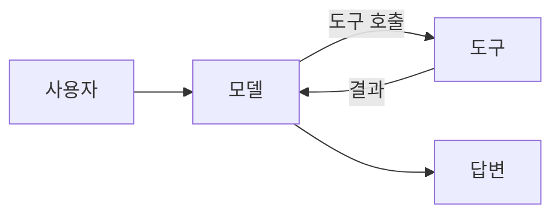

import Lead from 'stack-site-builder/components/Lead.astro';
import Bookmark from 'stack-site-builder/components/Bookmark.astro';
import Embed from 'stack-site-builder/components/Embed.astro';

<Lead>에이전트는 루프입니다: 모델이 판단하고, 도구가 실행되고, 결과가 다시 모델로 돌아갑니다. 이 강의에서 그 루프를 바닥부터 만듭니다.</Lead>

## 무엇을 만드나요 \{#what-youll-build}

검색하고 요약하는 단일 파일 에이전트를 예산 가드레일과 함께 만듭니다.

## 준비물 \{#prerequisites}

기본적인 Python과 API 키. 아래 글이 사고 모델을 잡아줍니다:

<Bookmark
  url="https://www.anthropic.com/engineering/building-effective-agents"
  title="Building effective agents"
  description="에이전트 시스템의 패턴 — 워크플로와 에이전트, 각각 언제 쓰는지."
/>

## 직접 해보기 \{#try-it}

<Embed src="https://example.invalid/demo/agent-loop/" title="에이전트 루프 데모" ratio="4:3" />
