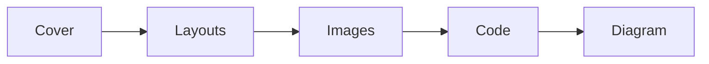
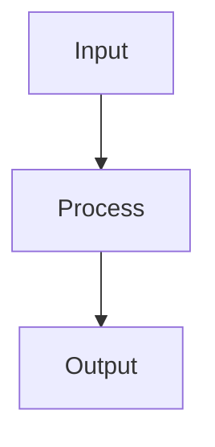
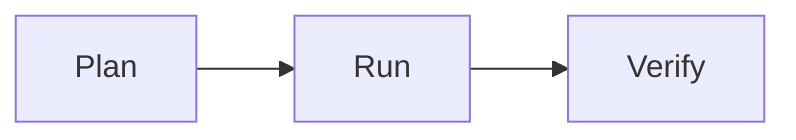
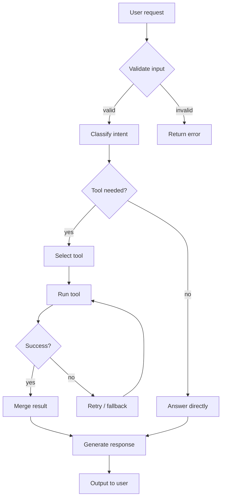
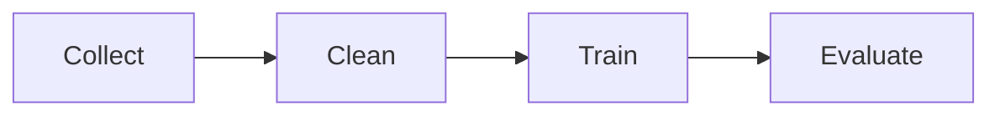
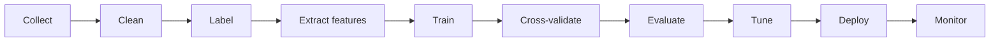

import { Image } from 'astro:assets';
import Slide from 'stack-site-builder/components/Slide.astro';

{/*
  Two ways to add images:
  1) assets — `@assets/...` (= src/assets). Best when several language decks
     share the same image (one copy).
  2) co-located — put the image next to this mdx and import it with `./file`.
     Best when each language uses a different image (this folder is this deck,
     this language). So this deck is a folder: index.mdx + images beside it.
*/}
import coverBg from '@assets/slides/sample-layouts/course-bg.png'; // ① assets (shared across languages)
import media from './course-bg-2.png'; // ② co-located (this deck only)

<Slide class="cover" bg={coverBg}>

# Layout sample

Every slide layout and element in one deck

*awesome-ai-stack · demo*

</Slide>

<Slide source="Source: awesome-ai-stack docs · example.com/docs">

## Default layout
::sub[A small subtitle under the title — added with `::sub[text]`]

`<Slide>` — with no class, the title is **pinned to the top** (the default slide).

- unordered list
- inline: **bold**, *italic*, `code`, [link](https://example.com)

1. ordered list
2. second item

> Blockquotes render like this.

</Slide>

<Slide>

## Bullet points

- The most common slide shape — one key point per line
- Keep items short and parallel
  - Add supporting detail as a sub-item
  - Indent one more level if needed
- Emphasize keywords in **bold**
- Close with the final point

</Slide>

<Slide>

## Numbered steps

1. **Collect** — gather the material and data you need
2. **Clean** — normalize the format, drop the noise
3. **Arrange** — lay it out to match the slide flow
4. **Review** — fold in feedback and refine

Use this when order matters — steps and procedures.

</Slide>

<Slide>

## Step reveal (steps)
::sub[Items inside `:::steps` appear one at a time as you press → ]

:::steps
- First point — press the arrow to reveal
- Second point — press again to continue
- Third point — the next item
- Once they're all shown, move to the next slide
:::

</Slide>

<Slide class="quote">

> A good talk is remembered as a story, not as slides.

::sub[— awesome-ai-stack · `class="quote"`]

</Slide>

<Slide>

## Stats · numbers

:::stats
### 99.9%
uptime
### 2.5×
faster
### 44KB
bundle / locale
:::

`:::stats` — big numbers (`###`) with labels, as cards. Each heading starts a new card.

</Slide>

<Slide>

## Callout boxes

:::note
**Note** — use `:::note` for asides and context.
:::

:::tip
**Tip** — `:::tip` highlights a useful hint.
:::

:::warning
**Warning** — `:::warning` is for cautions and gotchas.
:::

</Slide>

<Slide>

## Comparison (compare)

:::compare
### Build your own
- fully integrated with the site
- 44KB bundle / locale
- customize however you like
---
### External tool
- quick to start
- separate build & bundle
- feels bolted-on
:::

`:::compare` — side-by-side cards for trade-offs.

</Slide>

<Slide class="center">

## Center layout

`<Slide class="center">` — content is centered vertically and horizontally.

Good for a short emphasis slide or a section divider.

</Slide>

<Slide>

## Column layout

`:::cols` … `---` … `:::` — split into columns in pure Markdown.

:::cols
### Left column
- item A
- item B

*(`###` inside a column is a content sub-heading — only each slide's title goes in the TOC)*

---

### Right column
- item C
- item D
:::

</Slide>

<Slide>

## Table

| Layout | Syntax | Note |
| --- | --- | --- |
| cover | `class="cover"` | large centered title |
| background image | `bg={img}` | full-bleed |
| columns | `:::cols` | split with `---` |
| media split | `aas-split` | image · code · diagram |
| align/fill | `img-top`·`fill` | vertical position · cover |
| subtitle · source | `::sub[…]` · `source="…"` | under title · bottom-right |
| quote · stats | `class="quote"` · `:::stats` | hero quote · number cards |
| callout · compare | `:::note/tip/warning` · `:::compare` | boxes · side-by-side |
| steps · compact | `:::steps` · `class="compact"` | reveal one-by-one · natural size |
| TOC-excluded | `toc={false}` | heading hidden |

Tables use standard Markdown syntax. Hover a diagram or image for an **Enlarge** button, and press `o` for an overview of every slide. A long diagram scrolls inside its box — `aas-split scroll` (vertical) or `class="scroll-x"` (horizontal).

</Slide>

<Slide class="center">

## Code

Code slides — basic · left/right split · stacked

</Slide>

<Slide>

### Code basic

Code blocks get the same Shiki highlighting as the rest of the site.

```ts
async function goToSlide(deck: HTMLElement, i: number) {
  const target = deck.querySelectorAll('.aas-slide')[i];
  deck.scrollLeft = target.offsetLeft; // jump to the snap point
  return i;
}
```

</Slide>

<Slide>

### Code left, text right

<div class="aas-split">

```ts
function go(deck, i) {
  const s = deck
    .querySelectorAll('.aas-slide');
  deck.scrollLeft = s[i].offsetLeft;
}
```

<div>

Put the code block first and the text after inside `aas-split` to get code on the left.

- same split syntax as images
- long lines scroll inside the code

</div>
</div>

</Slide>

<Slide>

### Text left, code right

<div class="aas-split">
<div>

Just swap the order — text first, code block after, and the code is on the right.

- tune the ratio with `r-30-70` / `r-70-30`

</div>

```ts
function go(deck, i) {
  const s = deck
    .querySelectorAll('.aas-slide');
  deck.scrollLeft = s[i].offsetLeft;
}
```

</div>

</Slide>

<Slide>

### Code on top, text below

```ts
deck.scrollLeft = slide.offsetLeft; // jump to the snap point
```

Put the code block first and the caption underneath — no split needed, it just stacks.

</Slide>

<Slide class="center">

## Images

Image slides — placement · ratios · alignment · fill

</Slide>

<Slide source="Image: awesome-ai-stack sample asset">

### Image on top, text below

<Image src={media} alt="AI course background" class="aas-media-top" />

A large image on top with a short caption underneath. Hover the image for an Enlarge button.

</Slide>

<Slide>

### Image left, text right (50:50)

<div class="aas-split">
<Image src={media} alt="AI course background" />
<div>

Put the `<Image>` first and the text after inside `<div class="aas-split">` to get the image on the left.

- image and text split evenly
- good for a quick point

</div>
</div>

</Slide>

<Slide>

### Image left, text right (30:70)

<div class="aas-split r-30-70">
<Image src={media} alt="AI course background" />
<div>

The `r-30-70` modifier makes the image narrow (30%) and the text wide (70%).

Good when the copy is long or the image is just supporting.

</div>
</div>

</Slide>

<Slide>

### Text left, image right (50:50)

<div class="aas-split">
<div>

Just swap the order — text first, `<Image>` after, and the image is on the right.

- evenly split

</div>
<Image src={media} alt="AI course background" />
</div>

</Slide>

<Slide>

### Text left, image right (70:30)

<div class="aas-split r-70-30">
<div>

`r-70-30` makes the text wide (70%) and the image narrow (30%).

</div>
<Image src={media} alt="AI course background" />
</div>

</Slide>

<Slide>

### Image vertical alignment
::sub[Where the image sits in a vertically-filled (`tall`) slide — `img-top` · `img-center` · `img-bottom`]

Against a slide filled vertically, the image can sit at the top, center, or bottom. The next three slides show each.

</Slide>

<Slide>

#### Top (img-top)

<div class="aas-split tall r-30-70 img-top">
<Image src={media} alt="AI course background" />
<div>

`img-top` — in a vertically-filled slide the image sits at the **top**.

</div>
</div>

</Slide>

<Slide>

#### Center (img-center)

<div class="aas-split tall r-30-70 img-center">
<Image src={media} alt="AI course background" />
<div>

`img-center` — the image is **vertically centered** (the default).

</div>
</div>

</Slide>

<Slide>

#### Bottom (img-bottom)

<div class="aas-split tall r-30-70 img-bottom">
<Image src={media} alt="AI course background" />
<div>

`img-bottom` — in a vertically-filled slide the image sits at the **bottom**.

</div>
</div>

</Slide>

<Slide>

### Fill (cover)
::sub[`fill` — a tall image cropped to css `cover`]

<div class="aas-split fill">
<Image src={media} alt="AI course background" />
<div>

Add `fill` and the image fills the slide vertically; the overflow is cropped (`object-fit: cover`).

Works together with the ratio modifiers (`r-30-70`, etc.).

</div>
</div>

</Slide>

<Slide class="center">

## Diagrams

Diagram slides — basic · left/right split · stacked

</Slide>

<Slide>

### Diagram basic



Mermaid diagrams render in the current (light/dark) theme.

</Slide>

<Slide>

### Diagram left, text right

<div class="aas-split">



<div>

Just like images and code, put the diagram first inside `aas-split` to place it on the left.

- a vertical (`TB`) graph fits a narrow column well
- the diagram scales down to the column width

</div>
</div>

</Slide>

<Slide>

### Text left, diagram right

<div class="aas-split r-70-30">
<div>

Text first, diagram after, and the diagram is on the right.

Here `r-70-30` makes the text wide and the diagram narrow.

</div>


</div>

</Slide>

<Slide>

### Diagram on top, text below



Put the diagram first and the caption underneath — no split, it just stacks.

</Slide>

<Slide>

### Complex flowchart
::sub[Click to **enlarge** — if it's bigger than the screen, scroll inside the lightbox]



</Slide>

<Slide>

### Complex flowchart + notes
::sub[`aas-split scroll` — the diagram on the left scrolls vertically inside its column]

<div class="aas-split scroll">


<div>

How the agent handles a request.

1. **Validate input** — invalid requests return an error immediately
2. **Classify intent → decide if a tool is needed**
3. If so, **select → run → check success**, retry / fall back on failure
4. Merge the result or answer directly, then **output**

The diagram is long, so it scrolls vertically inside its column. Click it to enlarge.

</div>
</div>

</Slide>

<Slide>

### Scroll walkthrough
::sub[Press → and the flowchart on the left scrolls to that spot while the notes on the right change]

<div class="aas-split scroll">


<div>

:::step{scroll=0}
**① Validate** — check the request is valid, else return an error right away.
:::

:::step{scroll=35}
**② Decide** — classify the intent and decide whether a tool is needed.
:::

:::step{scroll=72}
**③ Run & check** — run the tool; on success merge the result, on failure retry / fall back.
:::

:::step{scroll=100}
**④ Output** — generate the response and hand it to the user.
:::

</div>
</div>

</Slide>

<Slide class="compact">

### Diagram + long text (compact)
::sub[`class="compact"` — the diagram keeps its natural size (just padded) and the text flows below]



A normal diagram slide fills the height, but `<Slide class="compact">` keeps the diagram at its **natural size** so you can write a longer explanation underneath.

- when you walk through each pipeline stage in prose
- when the diagram is a reference and the text carries the point
- when you need several paragraphs

Adding paragraphs like this doesn't push the diagram up — it stays put, with just a little padding around the box.

</Slide>

<Slide class="compact scroll-x">

### Wide diagram (horizontal scroll)
::sub[`class="compact scroll-x"` — a wide flowchart keeps its natural size and scrolls sideways inside the box]



A flowchart with many stages runs wide; shrinking it to fit makes the labels tiny. With `scroll-x` the diagram keeps its **natural size** and the box **scrolls horizontally** instead.

- good for data / ML pipelines with many stages
- every node stays a readable size
- click it to see the whole thing enlarged in the lightbox

</Slide>

<Slide class="compact scroll-x">

### Horizontal scroll walkthrough
::sub[Press → and the pipeline above **scrolls sideways** to that stage while the note below changes]


:::step{scroll=0}
**① Prepare data** — collect, clean, and label to build the training set.
:::

:::step{scroll=42}
**② Train** — extract features and train the model.
:::

:::step{scroll=72}
**③ Evaluate** — cross-validate and evaluate, then tune.
:::

:::step{scroll=100}
**④ Operate** — deploy, monitor, and retrain when needed.
:::

</Slide>

<Slide class="compact">

### Image walkthrough
::sub[Press → and the image scrolls to that region while the note below changes]

<div class="aas-scrollbox">
<Image src={media} alt="AI course background" />
</div>

:::step{scroll=0}
**① Top** — start at the top of the image.
:::

:::step{scroll=50}
**② Middle** — scroll to the centre.
:::

:::step{scroll=100}
**③ Bottom** — all the way down.
:::

</Slide>

<Slide>

### Code walkthrough
::sub[Press → to scroll the code and **highlight the whole line(s)** being explained]

<div class="aas-split scroll">

```ts
const SYSTEM = 'You can call tools.';

async function runAgent(input: string) {
  const messages = [
    { role: 'system', content: SYSTEM },
    { role: 'user', content: input },
  ];

  for (let turn = 0; turn < MAX_TURNS; turn++) {
    const res = await model.chat(messages);
    messages.push(res.message);

    if (!res.toolCalls?.length) {
      return res.message.content;
    }

    for (const call of res.toolCalls) {
      const out = await tools[call.name](call.args);
      messages.push({
        role: 'tool',
        content: out,
      });
    }
  }
  throw new Error('max turns exceeded');
}
```

<div>

:::step{lines="3-7"}
**① Entry** — start from the system and user messages.
:::

:::step{lines="9-11"}
**② Call the model** — each turn, call the model and record the reply.
:::

:::step{lines="13-15"}
**③ Stop condition** — with no tool calls, return the result.
:::

:::step{lines="17-23"}
**④ Run tools** — call each tool and feed the output back in.
:::

</div>
</div>

</Slide>

<Slide toc={false}>

## This heading is not in the TOC

This slide is wrapped in `<Slide toc={false}>`. Open the TOC (☰) and this heading **won't be listed** — the slide itself still pages through normally.

</Slide>

<Slide class="center">

## The end
::sub[`←` `→` navigate · `o` overview · click a diagram or image to enlarge]

Open `src/content/slides/en/sample-layouts/index.mdx` to see the syntax.

</Slide>
