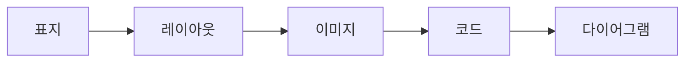
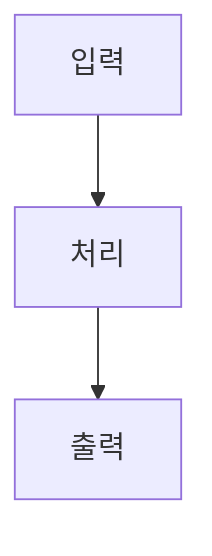
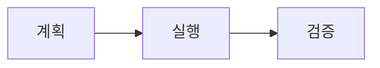
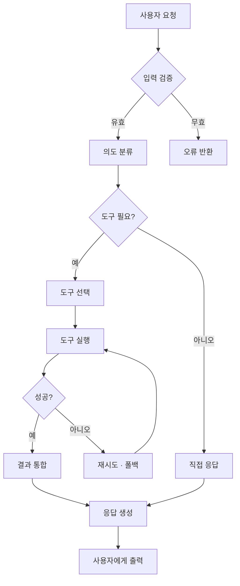
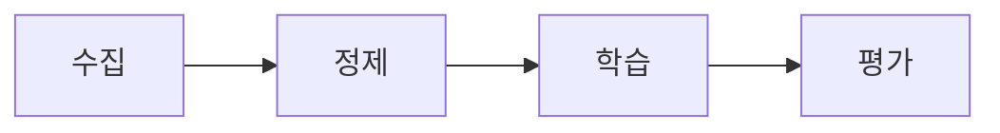
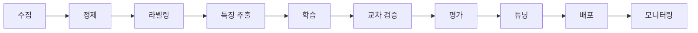

import { Image } from 'astro:assets';
import Slide from 'stack-site-builder/components/Slide.astro';

{/*
  이미지 넣는 두 방식:
  1) assets 방식 — `@assets/...`(= src/assets). 여러 언어 덱이 같은 이미지를 쓸 때.
  2) co-located 방식 — 이 mdx와 같은 폴더에 이미지를 두고 `./파일`로 import.
     언어별로 다른 이미지를 쓸 때(이 폴더가 곧 이 덱·이 언어 전용)에 좋습니다.
  그래서 이 덱은 index.mdx + 같은 폴더의 이미지 구조를 씁니다.
*/}
import coverBg from '@assets/slides/sample-layouts/course-bg.png'; // ① assets (언어 공통)
import media from './course-bg-2.png'; // ② co-located (이 덱 전용)

<Slide class="cover" bg={coverBg}>

# 레이아웃 샘플

모든 슬라이드 레이아웃과 요소를 한 덱에

*awesome-ai-stack · 데모*

</Slide>

<Slide source="출처: awesome-ai-stack 문서 · example.com/docs">

## 일반 레이아웃
::sub[제목 아래 작은 부제 — `::sub[텍스트]`로 답니다]

`<Slide>` — 클래스 없이 쓰면 제목이 **상단에 고정**되는 기본 슬라이드입니다.

- 순서 없는 목록
- 인라인: **굵게**, *기울임*, `코드`, [링크](https://example.com)

1. 순서 있는 목록
2. 두 번째 항목

> 인용문은 이렇게 표시됩니다.

</Slide>

<Slide>

## 불릿 포인트

- 발표에서 가장 흔한 형태 — 핵심을 한 줄씩
- 항목은 짧고 병렬 구조로
  - 하위 항목으로 근거를 답니다
  - 한 단계 더 들여쓰기도 됩니다
- **굵게**로 키워드를 강조
- 마지막 요점으로 마무리

</Slide>

<Slide>

## 번호 목록 · 단계

1. **수집** — 필요한 자료와 데이터를 모읍니다
2. **정제** — 형식을 맞추고 노이즈를 제거합니다
3. **구성** — 슬라이드 흐름에 맞게 배치합니다
4. **검토** — 피드백을 반영해 다듬습니다

순서가 중요한 단계·절차를 보여줄 때 씁니다.

</Slide>

<Slide>

## 단계별 표시 (steps)
::sub[`:::steps` 안의 항목은 →(화살표)를 누를 때 하나씩 나타납니다]

:::steps
- 첫 번째 요점 — 화살표를 누르면 등장
- 두 번째 요점 — 다시 누르면 이어서
- 세 번째 요점 — 그다음 항목
- 다 나오면 다음 슬라이드로 넘어갑니다
:::

</Slide>

<Slide class="quote">

> 좋은 발표는 슬라이드가 아니라 이야기로 남는다.

::sub[— awesome-ai-stack · `class="quote"`]

</Slide>

<Slide>

## 지표 · 숫자 (stats)

:::stats
### 99.9%
가동률
### 2.5×
빠른 처리
### 44KB
로케일당 번들
:::

`:::stats` — 큰 숫자(`###`)와 라벨을 카드로 나열합니다. 헤딩마다 새 카드가 됩니다.

</Slide>

<Slide>

## 콜아웃 박스

:::note
**참고** — `:::note`로 부가 설명이나 맥락을 담습니다.
:::

:::tip
**팁** — `:::tip`은 유용한 힌트를 강조합니다.
:::

:::warning
**주의** — `:::warning`은 경고·주의사항에 씁니다.
:::

</Slide>

<Slide>

## 비교 (compare)

:::compare
### 직접 만들기
- 사이트와 완전 통합
- 번들 44KB / 로케일
- 원하는 대로 커스터마이즈
---
### 외부 도구
- 빠른 시작
- 별도 빌드·번들
- 사이트와 이질감
:::

`:::compare` — 좌우 카드로 장단점을 나란히 봅니다.

</Slide>

<Slide class="center">

## 중앙 정렬 레이아웃

`<Slide class="center">` — 내용이 세로·가로 중앙에 옵니다.

짧은 강조 슬라이드나 섹션 구분에 좋습니다.

</Slide>

<Slide>

## 컬럼 레이아웃

`:::cols` … `---` … `:::` — 순수 마크다운으로 컬럼을 나눕니다.

:::cols
### 왼쪽 열
- 항목 A
- 항목 B

*(열 안의 `###`은 내용 소제목 — 목차엔 각 슬라이드의 제목만 들어갑니다)*

---

### 오른쪽 열
- 항목 C
- 항목 D
:::

</Slide>

<Slide>

## 표

| 레이아웃 | 문법 | 비고 |
| --- | --- | --- |
| 표지 | `class="cover"` | 큰 제목, 중앙 |
| 배경 이미지 | `bg={img}` | 풀블리드 |
| 컬럼 | `:::cols` | `---`로 구분 |
| 미디어 분할 | `aas-split` | 이미지·코드·다이어그램 |
| 세로 정렬/채움 | `img-top`·`fill` | 세로 위치·cover |
| 부제 · 출처 | `::sub[…]` · `source="…"` | 제목 아래 · 우측 하단 |
| 인용 · 지표 | `class="quote"` · `:::stats` | 대형 인용 · 숫자 카드 |
| 콜아웃 · 비교 | `:::note/tip/warning` · `:::compare` | 강조 박스 · 좌우 카드 |
| 단계 · compact | `:::steps` · `class="compact"` | 화살표로 하나씩 · 자연 크기 |
| 목차 제외 | `toc={false}` | 제목 숨김 |

표는 표준 마크다운 문법을 그대로 씁니다. 다이어그램·이미지는 마우스를 올리면 **크게 보기** 버튼이 나타나고, `o` 키로 전체 슬라이드를 한눈에 볼 수 있습니다. 긴 다이어그램은 `aas-split scroll`(세로)·`class="scroll-x"`(가로)로 박스 안에서 스크롤됩니다.

</Slide>

<Slide class="center">

## 코드

코드 슬라이드 모음 — 기본 · 좌우 배치 · 위아래 배치

</Slide>

<Slide>

### 코드 기본

코드 블록은 사이트와 동일한 Shiki 하이라이팅이 적용됩니다.

```ts
async function goToSlide(deck: HTMLElement, i: number) {
  const target = deck.querySelectorAll('.aas-slide')[i];
  deck.scrollLeft = target.offsetLeft; // 스냅 지점으로 이동
  return i;
}
```

</Slide>

<Slide>

### 코드 왼쪽 · 글 오른쪽

<div class="aas-split">

```ts
function go(deck, i) {
  const s = deck
    .querySelectorAll('.aas-slide');
  deck.scrollLeft = s[i].offsetLeft;
}
```

<div>

`aas-split` 안에 코드 블록을 먼저, 글을 나중에 두면 코드가 왼쪽입니다.

- 이미지와 똑같은 분할 문법
- 긴 줄은 코드 안에서 스크롤됩니다

</div>
</div>

</Slide>

<Slide>

### 글 왼쪽 · 코드 오른쪽

<div class="aas-split">
<div>

순서만 바꾸면 됩니다 — 글을 먼저, 코드 블록을 나중에 두면 코드가 오른쪽입니다.

- `r-30-70`·`r-70-30`으로 비율도 조절

</div>

```ts
function go(deck, i) {
  const s = deck
    .querySelectorAll('.aas-slide');
  deck.scrollLeft = s[i].offsetLeft;
}
```

</div>

</Slide>

<Slide>

### 코드 위 · 설명 아래

```ts
deck.scrollLeft = slide.offsetLeft; // 스냅 지점으로 이동
```

코드 블록을 먼저 두고 아래에 설명을 답니다 — 분할 없이 자연스럽게 위아래로 쌓입니다.

</Slide>

<Slide class="center">

## 이미지

이미지 슬라이드 모음 — 배치 · 비율 · 정렬 · 채움

</Slide>

<Slide source="이미지: awesome-ai-stack 샘플 에셋">

### 이미지 위 · 설명 아래

<Image src={media} alt="AI 강의 배경" class="aas-media-top" />

이미지를 위에 크게 두고, 아래에 짧은 설명을 답니다. 이미지에 마우스를 올리면 크게 보기 버튼이 나옵니다.

</Slide>

<Slide>

### 이미지 왼쪽 · 글 오른쪽 (50:50)

<div class="aas-split">
<Image src={media} alt="AI 강의 배경" />
<div>

`<div class="aas-split">` 안에 `<Image>`를 먼저, 글을 나중에 두면 이미지가 왼쪽입니다.

- 이미지와 글이 반반
- 요점 정리에 적합

</div>
</div>

</Slide>

<Slide>

### 이미지 왼쪽 · 글 오른쪽 (30:70)

<div class="aas-split r-30-70">
<Image src={media} alt="AI 강의 배경" />
<div>

`r-30-70` 모디파이어로 이미지를 좁게(30%), 글을 넓게(70%) 둡니다.

설명이 길거나 이미지는 참고용일 때 좋습니다.

</div>
</div>

</Slide>

<Slide>

### 글 왼쪽 · 이미지 오른쪽 (50:50)

<div class="aas-split">
<div>

순서만 바꾸면 됩니다 — 글을 먼저, `<Image>`를 나중에 두면 이미지가 오른쪽입니다.

- 좌우 반반

</div>
<Image src={media} alt="AI 강의 배경" />
</div>

</Slide>

<Slide>

### 글 왼쪽 · 이미지 오른쪽 (70:30)

<div class="aas-split r-70-30">
<div>

`r-70-30`으로 글을 넓게(70%), 이미지를 좁게(30%) 둡니다.

</div>
<Image src={media} alt="AI 강의 배경" />
</div>

</Slide>

<Slide>

### 이미지 세로 정렬
::sub[`tall`로 세로를 채운 슬라이드에서 이미지의 세로 위치 — `img-top` · `img-center` · `img-bottom`]

세로로 꽉 찬 슬라이드를 기준으로 이미지를 위 · 가운데 · 아래에 둘 수 있습니다. 다음 세 슬라이드에서 각각 보여줍니다.

</Slide>

<Slide>

#### 세로 위 (img-top)

<div class="aas-split tall r-30-70 img-top">
<Image src={media} alt="AI 강의 배경" />
<div>

`img-top` — 세로로 찬 슬라이드에서 이미지가 **위**에 붙습니다.

</div>
</div>

</Slide>

<Slide>

#### 세로 가운데 (img-center)

<div class="aas-split tall r-30-70 img-center">
<Image src={media} alt="AI 강의 배경" />
<div>

`img-center` — 세로로 찬 슬라이드에서 이미지가 **세로 가운데**에 옵니다 (기본값).

</div>
</div>

</Slide>

<Slide>

#### 세로 아래 (img-bottom)

<div class="aas-split tall r-30-70 img-bottom">
<Image src={media} alt="AI 강의 배경" />
<div>

`img-bottom` — 세로로 찬 슬라이드에서 이미지가 **아래**에 붙습니다.

</div>
</div>

</Slide>

<Slide>

### 꽉 채우기 (cover)
::sub[`fill` — 이미지를 세로로 크게, css `cover`로 크롭]

<div class="aas-split fill">
<Image src={media} alt="AI 강의 배경" />
<div>

`fill`을 더하면 이미지가 세로로 꽉 차고, 넘치는 부분은 잘립니다 (`object-fit: cover`).

비율 모디파이어(`r-30-70` 등)와 함께 쓸 수 있습니다.

</div>
</div>

</Slide>

<Slide class="center">

## 다이어그램

다이어그램 슬라이드 모음 — 기본 · 좌우 배치 · 위아래 배치

</Slide>

<Slide>

### 다이어그램 기본



Mermaid 다이어그램은 테마(라이트/다크)에 맞춰 렌더됩니다.

</Slide>

<Slide>

### 다이어그램 왼쪽 · 글 오른쪽

<div class="aas-split">



<div>

이미지·코드와 똑같이, `aas-split` 안에 다이어그램을 먼저 두면 왼쪽에 옵니다.

- 좁은 열에선 세로 방향(`TB`)이 잘 맞습니다
- 다이어그램은 열 폭에 맞춰 축소됩니다

</div>
</div>

</Slide>

<Slide>

### 글 왼쪽 · 다이어그램 오른쪽

<div class="aas-split r-70-30">
<div>

글을 먼저, 다이어그램을 나중에 두면 다이어그램이 오른쪽입니다.

`r-70-30`으로 글을 넓게, 다이어그램을 좁게 두었습니다.

</div>


</div>

</Slide>

<Slide>

### 다이어그램 위 · 설명 아래



다이어그램을 먼저 두고 아래에 설명을 답니다 — 분할 없이 위아래로 쌓입니다.

</Slide>

<Slide>

### 복잡한 순서도
::sub[클릭해서 **크게 보기** — 화면보다 크면 라이트박스 안에서 스크롤됩니다]



</Slide>

<Slide>

### 복잡한 순서도 + 설명
::sub[`aas-split scroll` — 왼쪽 다이어그램은 열 안에서 세로로 스크롤됩니다]

<div class="aas-split scroll">


<div>

에이전트가 요청을 처리하는 흐름입니다.

1. **입력 검증** — 유효하지 않으면 즉시 오류를 반환합니다
2. **의도 분류 → 도구 필요 여부** 판단
3. 필요하면 **도구 선택 → 실행 → 성공 확인**, 실패 시 재시도·폴백
4. 결과를 통합하거나 직접 응답해 **최종 출력**

다이어그램이 길어 열 안에서 세로로 스크롤됩니다. 클릭하면 크게 볼 수 있습니다.

</div>
</div>

</Slide>

<Slide>

### 스크롤 워크스루
::sub[→(화살표)를 누르면 왼쪽 순서도가 해당 위치로 스크롤되고 오른쪽 설명이 바뀝니다]

<div class="aas-split scroll">


<div>

:::step{scroll=0}
**① 입력 검증** — 요청이 유효한지 확인하고, 아니면 바로 오류를 반환합니다.
:::

:::step{scroll=35}
**② 도구 판단** — 의도를 분류하고 도구가 필요한지 결정합니다.
:::

:::step{scroll=72}
**③ 실행·검증** — 도구를 실행해 성공하면 결과를 통합, 실패하면 재시도·폴백합니다.
:::

:::step{scroll=100}
**④ 최종 출력** — 응답을 생성해 사용자에게 전달합니다.
:::

</div>
</div>

</Slide>

<Slide class="compact">

### 다이어그램 + 긴 설명 (compact)
::sub[`class="compact"` — 다이어그램은 자연 크기(패딩만) 그대로, 아래로 글이 길게 흐릅니다]



기본 다이어그램 슬라이드는 세로를 꽉 채우지만, `<Slide class="compact">`를 쓰면 다이어그램이 **원래 크기**로 자리하고 아래에 설명을 길게 이어 쓸 수 있습니다.

- 파이프라인의 각 단계를 문장으로 풀어 설명할 때
- 다이어그램은 참고용이고 글이 주가 될 때
- 여러 문단이 필요할 때 적합합니다

이렇게 문단을 이어서 넣어도 다이어그램이 위로 밀려 올라가지 않고, 박스에는 약간의 패딩만 유지됩니다.

</Slide>

<Slide class="compact scroll-x">

### 가로로 긴 다이어그램 (가로 스크롤)
::sub[`class="compact scroll-x"` — 넓은 순서도는 줄이지 않고 자연 크기 그대로, 박스 안에서 가로로 스크롤됩니다]



파이프라인처럼 단계가 많아 가로로 긴 순서도는, 폭에 맞춰 축소하면 글자가 너무 작아집니다. `scroll-x`를 쓰면 다이어그램이 **원래 크기**를 유지하고 박스 안에서 **좌우로 스크롤**됩니다.

- 데이터·ML 파이프라인처럼 단계가 많은 흐름에 적합합니다
- 각 노드는 읽기 좋은 크기를 유지합니다
- 클릭하면 라이트박스로 전체를 크게 볼 수 있습니다

</Slide>

<Slide class="compact scroll-x">

### 가로 스크롤 워크스루
::sub[→(화살표)를 누르면 위쪽 파이프라인이 해당 단계로 **가로 스크롤**되고 아래 설명이 바뀝니다]


:::step{scroll=0}
**① 데이터 준비** — 수집·정제·라벨링으로 학습용 데이터를 만듭니다.
:::

:::step{scroll=42}
**② 학습** — 특징을 추출하고 모델을 학습합니다.
:::

:::step{scroll=72}
**③ 평가** — 교차 검증과 평가로 성능을 확인하고 튜닝합니다.
:::

:::step{scroll=100}
**④ 운영** — 배포하고 모니터링하며 필요하면 다시 학습합니다.
:::

</Slide>

<Slide class="compact">

### 이미지 워크스루
::sub[→(화살표)를 누르면 이미지가 해당 영역으로 스크롤되고 아래 설명이 바뀝니다]

<div class="aas-scrollbox">
<Image src={media} alt="AI 강의 배경" />
</div>

:::step{scroll=0}
**① 위쪽** — 이미지의 상단 영역부터 봅니다.
:::

:::step{scroll=50}
**② 가운데** — 중앙 영역으로 스크롤됩니다.
:::

:::step{scroll=100}
**③ 아래쪽** — 하단까지 스크롤됩니다.
:::

</Slide>

<Slide>

### 코드 워크스루
::sub[→를 누르면 코드가 해당 부분으로 스크롤되고 **그 줄 전체가 강조**됩니다]

<div class="aas-split scroll">

```ts
const SYSTEM = 'You can call tools.';

async function runAgent(input: string) {
  const messages = [
    { role: 'system', content: SYSTEM },
    { role: 'user', content: input },
  ];

  for (let turn = 0; turn < MAX_TURNS; turn++) {
    const res = await model.chat(messages);
    messages.push(res.message);

    if (!res.toolCalls?.length) {
      return res.message.content;
    }

    for (const call of res.toolCalls) {
      const out = await tools[call.name](call.args);
      messages.push({
        role: 'tool',
        content: out,
      });
    }
  }
  throw new Error('max turns exceeded');
}
```

<div>

:::step{lines="3-7"}
**① 진입점** — 시스템·사용자 메시지로 대화를 시작합니다.
:::

:::step{lines="9-11"}
**② 모델 호출** — 매 턴 모델을 호출하고 응답을 기록합니다.
:::

:::step{lines="13-15"}
**③ 종료 조건** — 도구 호출이 없으면 결과를 반환합니다.
:::

:::step{lines="17-23"}
**④ 도구 실행** — 도구를 호출하고 결과를 대화에 넣습니다.
:::

</div>
</div>

</Slide>

<Slide toc={false}>

## 이 제목은 목차에 없습니다

이 슬라이드는 `<Slide toc={false}>`로 감쌌습니다. 우측 목차(☰)를 열어 보면 이 제목은 **나타나지 않습니다** — 슬라이드 자체는 그대로 넘겨집니다.

</Slide>

<Slide class="center">

## 끝
::sub[`←` `→` 이동 · `o` 한눈에 보기 · 다이어그램·이미지 클릭 시 확대]

문법이 궁금하면 `src/content/slides/ko/sample-layouts/index.mdx` 를 열어 보세요.

</Slide>
